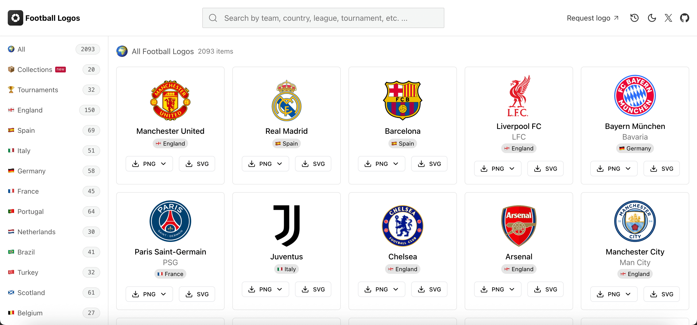

    <h1>✨⚽️ Football Logos ⚽️✨</h1>
    
    <a href="https://football-logos.cc">
        football-logos.cc
    </a>

## 🏆 [Tournaments](https://football-logos.cc/tournaments/)

## 🏴󠁧󠁢󠁥󠁮󠁧󠁿 [England](https://football-logos.cc/england/)

## 🇪🇸 [Spain](https://football-logos.cc/spain/)

## 🇮🇹 [Italy](https://football-logos.cc/italy/)

## 🇩🇪 [Germany](https://football-logos.cc/germany/)

## 🇫🇷 [France](https://football-logos.cc/france/)

## 🇵🇹 [Portugal](https://football-logos.cc/portugal/)

## 🇳🇱 [Netherlands](https://football-logos.cc/netherlands/)

## 🇧🇷 [Brazil](https://football-logos.cc/brazil/)

## 🇹🇷 [Turkey](https://football-logos.cc/turkey/)

## 🏴󠁧󠁢󠁳󠁣󠁴󠁿 [Scotland](https://football-logos.cc/scotland/)

## 🇧🇪 [Belgium](https://football-logos.cc/belgium/)

## 🇦🇷 [Argentina](https://football-logos.cc/argentina/)

## 🇦🇫 [Afghanistan](https://football-logos.cc/afghanistan/)

## 🇦🇱 [Albania](https://football-logos.cc/albania/)

## 🇩🇿 [Algeria](https://football-logos.cc/algeria/)

## 🇦🇩 [Andorra](https://football-logos.cc/andorra/)

## 🇦🇴 [Angola](https://football-logos.cc/angola/)

## 🇦🇲 [Armenia](https://football-logos.cc/armenia/)

## 🇦🇺 [Australia](https://football-logos.cc/australia/)

## 🇦🇹 [Austria](https://football-logos.cc/austria/)

## 🇦🇿 [Azerbaijan](https://football-logos.cc/azerbaijan/)

## 🇧🇭 [Bahrain](https://football-logos.cc/bahrain/)

## 🇧🇩 [Bangladesh](https://football-logos.cc/bangladesh/)

## 🇧🇾 [Belarus](https://football-logos.cc/belarus/)

## 🇧🇯 [Benin](https://football-logos.cc/benin/)

## 🇧🇴 [Bolivia](https://football-logos.cc/bolivia/)

## 🇧🇦 [Bosnia and Herzegovina](https://football-logos.cc/bosnia-and-herzegovina/)

## 🇧🇼 [Botswana](https://football-logos.cc/botswana/)

## 🇧🇬 [Bulgaria](https://football-logos.cc/bulgaria/)

## 🇧🇫 [Burkina Faso](https://football-logos.cc/burkina-faso/)

## 🇨🇻 [Cabo Verde](https://football-logos.cc/cabo-verde/)

## 🇨🇲 [Cameroon](https://football-logos.cc/cameroon/)

## 🇨🇦 [Canada](https://football-logos.cc/canada/)

## 🇨🇱 [Chile](https://football-logos.cc/chile/)

## 🇨🇳 [China](https://football-logos.cc/china/)

## 🇨🇴 [Colombia](https://football-logos.cc/colombia/)

## 🇰🇲 [Comoros](https://football-logos.cc/comoros/)

## 🇭🇷 [Croatia](https://football-logos.cc/croatia/)

## 🇨🇺 [Cuba](https://football-logos.cc/cuba/)

## 🇨🇩 [Democratic Republic of the Congo](https://football-logos.cc/congo-dr/)

## 🇨🇷 [Costa Rica](https://football-logos.cc/costa-rica/)

## 🇨🇮 [Côte d'Ivoire](https://football-logos.cc/cote-d-ivoire/)

## 🇨🇾 [Cyprus](https://football-logos.cc/cyprus/)

## 🇨🇿 [Czech Republic](https://football-logos.cc/czech-republic/)

## 🇨🇼 [Curacao](https://football-logos.cc/curacao/)

## 🇩🇰 [Denmark](https://football-logos.cc/denmark/)

## 🇪🇨 [Ecuador](https://football-logos.cc/ecuador/)

## 🇪🇬 [Egypt](https://football-logos.cc/egypt/)

## 🇸🇻 [El Salvador](https://football-logos.cc/el-salvador/)

## 🇬🇶 [Equatorial Guinea](https://football-logos.cc/equatorial-guinea/)

## 🇪🇪 [Estonia](https://football-logos.cc/estonia/)

## 🇪🇹 [Ethiopia](https://football-logos.cc/ethiopia/)

## 🇫🇴 [Faroe Islands](https://football-logos.cc/faroe-islands/)

## 🇫🇮 [Finland](https://football-logos.cc/finland/)

## 🇬🇦 [Gabon](https://football-logos.cc/gabon/)

## 🇬🇪 [Georgia](https://football-logos.cc/georgia/)

## 🇬🇹 [Guatemala](https://football-logos.cc/guatemala/)

## 🇬🇮 [Gibraltar](https://football-logos.cc/gibraltar/)

## 🇬🇭 [Ghana](https://football-logos.cc/ghana/)

## 🇬🇷 [Greece](https://football-logos.cc/greece/)

## 🇭🇹 [Haiti](https://football-logos.cc/haiti/)

## 🇭🇳 [Honduras](https://football-logos.cc/honduras/)

## 🇭🇺 [Hungary](https://football-logos.cc/hungary/)

## 🇮🇸 [Iceland](https://football-logos.cc/iceland/)

## 🇮🇳 [India](https://football-logos.cc/india/)

## 🇮🇩 [Indonesia](https://football-logos.cc/indonesia/)

## 🇮🇷 [Iran](https://football-logos.cc/iran/)

## 🇮🇶 [Iraq](https://football-logos.cc/iraq/)

## 🇮🇱 [Israel](https://football-logos.cc/israel/)

## 🇯🇲 [Jamaica](https://football-logos.cc/jamaica/)

## 🇯🇵 [Japan](https://football-logos.cc/japan/)

## 🇯🇴 [Jordan](https://football-logos.cc/jordan/)

## 🇰🇿 [Kazakhstan](https://football-logos.cc/kazakhstan/)

## 🇰🇪 [Kenya](https://football-logos.cc/kenya/)

## 🇽🇰 [Kosovo](https://football-logos.cc/kosovo/)

## 🇱🇻 [Latvia](https://football-logos.cc/latvia/)

## 🇱🇧 [Lebanon](https://football-logos.cc/lebanon/)

## 🇱🇷 [Liberia](https://football-logos.cc/liberia/)

## 🇱🇮 [Liechtenstein](https://football-logos.cc/liechtenstein/)

## 🇱🇹 [Lithuania](https://football-logos.cc/lithuania/)

## 🇱🇺 [Luxembourg](https://football-logos.cc/luxembourg/)

## 🇲🇾 [Malaysia](https://football-logos.cc/malaysia/)

## 🇲🇲 [Mali](https://football-logos.cc/mali/)

## 🇲🇹 [Malta](https://football-logos.cc/malta/)

## 🇲🇽 [Mexico](https://football-logos.cc/mexico/)

## 🇲🇩 [Moldova](https://football-logos.cc/moldova/)

## 🇲🇪 [Montenegro](https://football-logos.cc/montenegro/)

## 🇲🇦 [Morocco](https://football-logos.cc/morocco/)

## 🇲🇿 [Mozambique](https://football-logos.cc/mozambique/)

## 🇳🇦 [Namibia](https://football-logos.cc/namibia/)

## 🇳🇬 [Nigeria](https://football-logos.cc/nigeria/)

## 🇲🇰 [North Macedonia](https://football-logos.cc/north-macedonia/)

## 🏴 [Northern Ireland](https://football-logos.cc/northern-ireland/)

## 🇳🇴 [Norway](https://football-logos.cc/norway/)

## 🇳🇵 [Nepal](https://football-logos.cc/nepal/)

## 🇳🇿 [New Zealand](https://football-logos.cc/new-zealand/)

## 🇳🇮 [Nicaragua](https://football-logos.cc/nicaragua/)

## 🇴🇲 [Oman](https://football-logos.cc/oman/)

## 🇵🇰 [Pakistan](https://football-logos.cc/pakistan/)

## 🇵🇦 [Peru](https://football-logos.cc/peru/)

## 🇵🇱 [Poland](https://football-logos.cc/poland/)

## 🇵🇦 [Panama](https://football-logos.cc/panama/)

## 🇵🇾 [Paraguay](https://football-logos.cc/paraguay/)

## 🇵🇸 [Palestine](https://football-logos.cc/palestine/)

## 🇶🇦 [Qatar](https://football-logos.cc/qatar/)

## 🇮🇪 [Republic of Ireland](https://football-logos.cc/republic-of-ireland/)

## 🇷🇴 [Romania](https://football-logos.cc/romania/)

## 🏳 [russia](https://football-logos.cc/russia/)

## 🇸🇲 [San Marino](https://football-logos.cc/san-marino/)

## 🇸🇦 [Saudi Arabia](https://football-logos.cc/saudi-arabia/)

## 🇸🇳 [Senegal](https://football-logos.cc/senegal/)

## 🇸🇬 [Singapore](https://football-logos.cc/singapore/)

## 🇷🇸 [Serbia](https://football-logos.cc/serbia/)

## 🇸🇰 [Slovakia](https://football-logos.cc/slovakia/)

## 🇸🇮 [Slovenia](https://football-logos.cc/slovenia/)

## 🇸🇴 [Somalia](https://football-logos.cc/somalia/)

## 🇿🇦 [South Africa](https://football-logos.cc/south-africa/)

## 🇰🇷 [South Korea](https://football-logos.cc/south-korea/)

## 🇸🇩 [Sudan](https://football-logos.cc/sudan/)

## 🇸🇷 [Suriname](https://football-logos.cc/suriname/)

## 🇸🇪 [Sweden](https://football-logos.cc/sweden/)

## 🇨🇭 [Switzerland](https://football-logos.cc/switzerland/)

## 🇸🇾 [Syria](https://football-logos.cc/syria/)

## 🇹🇿 [Tanzania](https://football-logos.cc/tanzania/)

## 🇹🇭 [Thailand](https://football-logos.cc/thailand/)

## 🇹🇬 [Togo](https://football-logos.cc/togo/)

## 🇹🇳 [Tunisia](https://football-logos.cc/tunisia/)

## 🇦🇪 [United Arab Emirates](https://football-logos.cc/uae/)

## 🇺🇬 [Uganda](https://football-logos.cc/uganda/)

## 🇺🇦 [Ukraine](https://football-logos.cc/ukraine/)

## 🇺🇾 [Uruguay](https://football-logos.cc/uruguay/)

## 🇺🇸 [USA](https://football-logos.cc/usa/)

## 🇺🇿 [Uzbekistan](https://football-logos.cc/uzbekistan/)

## 🇻🇪 [Venezuela](https://football-logos.cc/venezuela/)

## 🇻🇳 [Vietnam](https://football-logos.cc/vietnam/)

## 🏴󠁧󠁢󠁷󠁬󠁳󠁿 [Wales](https://football-logos.cc/wales/)

## 🇿🇲 [Zambia](https://football-logos.cc/zambia/)

